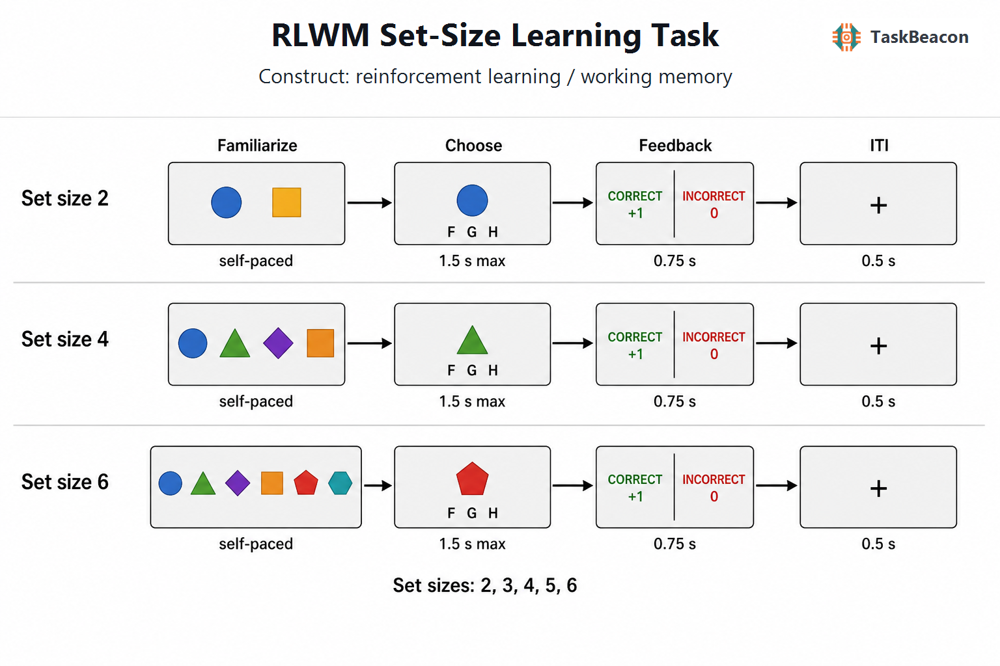

# 强化学习—工作记忆集合大小学习任务：容量约束、学习交互与解释边界

反馈驱动的工具性学习通常由近期事件保持与跨试次经验积累共同支持；仅依据正确率随练习上升，难以区分两类过程。强化学习—工作记忆集合大小学习任务（Reinforcement Learning and Working Memory Set-Size Learning Task, RLWM）通过改变同一区组内需要学习的刺激—动作对应关系数量，并分析同一刺激重复出现的间隔，为这一分离提供了实验约束。其价值在于检验容量、遗忘和学习经验如何共同塑造选择，而不能由任务名称预先认定全部表现来自强化学习。近期综述强调，工作记忆与强化学习在行为和神经实现上存在相互影响，忽略其中任何一方均可能改变对另一方的估计（[Yoo & Collins, 2022](https://doi.org/10.1162/jocn_a_01808)）。

## 1. 范式提出与理论背景

RLWM 延续了条件联合学习中依靠试误反馈习得任意刺激—反应映射的基本操作；早期额叶损伤研究已用此类任务检验映射习得及保持（[Petrides, 1985](https://doi.org/10.1016/0028-3932(85)90062-4)）。Collins 与 Frank 于 2012 年进一步参数化同一区组内的映射数量，针对常规强化学习模型将快速记忆策略误归入学习率的问题。经典模型以奖励预测误差（reward prediction error, RPE）更新动作价值；若某刺激的动作和反馈历史相同，其学习原则上不应因区组内其他刺激增多而系统性改变。工作记忆则受到并行保持数量和重复间隔的约束。因此，集合大小效应与间隔效应为超出单一增量学习模型的行为成分提供了证据（[Collins & Frank, 2012](https://doi.org/10.1111/j.1460-9568.2011.07980.x)）。

RLWM 模型据此将快速、容量受限且易遗忘的工作记忆成分，与较慢的经验积累成分相结合，并允许二者对选择的贡献随负荷和练习变化。工作记忆中的一次有效编码可以迅速支持正确选择；较慢成分则在反复经验后继续支持表现。这里的“双成分”是一组可检验的计算假设，不能直接等同于两个完全独立的脑区系统。后续研究逐渐从比较两种成分对选择的权重，转向检验工作记忆是否还改变价值预期、反馈更新和长期保持（[Collins & Frank, 2018](https://doi.org/10.1073/pnas.1720963115); [Yoo & Collins, 2022](https://doi.org/10.1162/jocn_a_01808)）。

## 2. 任务逻辑、流程与核心参数

任务以独立区组组织，每组先展示完整刺激集合，再逐一呈现刺激，要求从三个动作中学习正确对应关系。集合大小通常为 2–6；同组映射保持稳定，反馈如实表明正确或错误。不同刺激的正确动作独立分配，多个刺激可以对应同一个键，因而不能仅靠已知映射排除其他刺激的选项。原始版本包含 19 个区组，每刺激至少呈现 9 次、至多 15 次，并以各刺激最近五次中至少四次正确作为提前结束标准；刺激呈现 2 s，随后给予确定性听觉反馈，试次间隔为 2.5 s（[Collins & Frank, 2012](https://doi.org/10.1111/j.1460-9568.2011.07980.x)）。

后续版本保留负荷操控，但会调整试次数、时限与反馈形式。跨研究常见流程如下；这些时长是代表性范围，不构成唯一标准协议（[Collins, 2026](https://doi.org/10.1038/s41562-025-02340-0)）。

| 阶段 | 代表性操作与时序 | 主要解释对象 |
|---|---|---|
| 区组熟悉 | 呈现本组全部刺激；各组使用新的刺激集合 | 明确并行学习负荷，降低初始刺激陌生性 |
| 刺激与选择 | 单刺激出现，三个动作中择一；常见反应窗约 1.5 s | 映射提取、动作价值与反应选择 |
| 反馈 | 正确/错误或 +1/0；常见持续 0.5–1 s | 对当前选择结果的编码和后续更新 |
| 试次间隔 | 常见约 0.5 s；扫描版本可加入抖动 | 控制事件时序；不等同于同刺激重复间隔 |

集合大小在区组间变化，刺激间隔则在区组内随伪随机顺序变化。学习曲线应以某刺激的出现次数为横轴，而非直接比较不同集合大小下的区组总试次序号。主要指标包括正确率、反应时、遗漏率、既往正确次数和重复间隔的效应；在已获正确反馈之后仍出错的概率尤其有助于检验保持失败。间隔必须明确是距上次呈现还是距上次正确反应，两者在错误较多时并不等价（[Collins & Frank, 2012](https://doi.org/10.1111/j.1460-9568.2011.07980.x); [McDougle & Collins, 2021](https://doi.org/10.3758/s13423-020-01774-z)）。

反应时也不能仅作为学习速度的替代指标。将 RLWM 与线性弹道累加器（linear ballistic accumulator, LBA）结合，可以同时解释正确与错误选择的反应时分布，并表明动作先验不确定性影响决策过程。该扩展还适用于概率反馈版本，提示反应数量相同并不意味着不同映射条件具有相同的选择难度（[McDougle & Collins, 2021](https://doi.org/10.3758/s13423-020-01774-z)）。

## 3. 主要行为与神经科学发现

### 3.1 快速习得、延迟保持与慢学习成分

行为上较稳定的模式是：低负荷条件早期习得迅速，高负荷条件表现较差、改善更渐进；随着经验增加，重复间隔与集合大小对表现的影响减弱。这一模式支持容量受限记忆在早期选择中的作用，也说明总体学习曲线包含随训练变化的过程混合。其解释依赖联合比较负荷、间隔和经验，单独观察高负荷正确率下降不能确定是容量不足、遗忘加快还是选择噪声增加（[Yoo & Collins, 2022](https://doi.org/10.1162/jocn_a_01808)）。

加入意外的无反馈测试，使范式能够区分训练时表现与之后的保持。低负荷下迅速习得的对应关系，在延迟测试中可能保持较差；较高负荷虽然延缓习得，却可改善之后的刺激—反应回忆。这一结果在后续参数化负荷研究中得到支持，表明较快达到训练正确率标准不必然意味着形成了更稳固的长期表征（[Collins, 2018](https://doi.org/10.1162/jocn_a_01238); [Rac-Lubashevsky et al., 2023](https://doi.org/10.1523/JNEUROSCI.1274-22.2023)）。不过，无反馈保持仍可能涉及多种长期记忆过程，不能仅凭测试时无法持续保持全部项目，就将表现归为纯强化学习。

慢学习成分的算法性质已受到直接检验。Collins（2026）重分析七个数据集、共 594 人，发现常规 RLWM 模型虽能重现学习曲线，却不足以解释高负荷时重复错误的分布。结合工作记忆与结果不敏感的刺激—动作联结成分的模型，即工作记忆—类习惯模型（WMH），能够更好地解释这些数据；其慢成分追踪选择频率，而非标准的预期奖励价值。这一结论限定于所检验任务、数据和候选模型，不能推广为人类不存在强化学习；但它要求研究者同时验证错误序列，避免由较慢改善或较优拟合直接推断标准 RPE 学习（[Collins, 2026](https://doi.org/10.1038/s41562-025-02340-0)）。

### 3.2 工作记忆对预期与反馈信号的调节

功能磁共振成像（functional magnetic resonance imaging, fMRI）研究将模型预测误差与血氧水平依赖信号联系起来，发现纹状体及外侧前额叶对 RPE 的敏感性在低集合大小时减弱；这种负荷调制与个体使用工作记忆的程度相关。因而，较低的神经 RPE 相关信号可能伴随更好的即时行为表现，不能直接视为学习能力下降。该研究的回归事件覆盖刺激、反应与反馈，且集合大小也影响重复间隔，其结果主要支持条件相关的交互，尚不能确定单一事件的因果机制（[Collins et al., 2017](https://doi.org/10.1523/JNEUROSCI.2700-16.2017)）。

脑电图（electroencephalography, EEG）的单试次解码补充了时间进程证据：选择阶段的神经预期指标越强，随后反馈阶段的惊讶或预测误差指标越弱；工作记忆相关信息能够进入对结果的预期。跨试次关系进一步支持工作记忆与增量学习在更新时相互影响，而不只是竞争当前反应的控制权（[Collins & Frank, 2018](https://doi.org/10.1073/pnas.1720963115)）。这类模型约束的脑电指标不等同于直接测量某个模型变量，头皮分布也不足以唯一定位其神经来源。

将 EEG 与两种保持测试结合后，学习时较强的增量学习神经指标可以预测之后的刺激—反应回忆，却未同样预测奖励价值保持。这一区别限制了将全部“神经学习信号”统一解释为奖励期望的做法，并提示已学动作策略与奖励大小知识可能具有不同的保持基础（[Rac-Lubashevsky et al., 2023](https://doi.org/10.1523/JNEUROSCI.1274-22.2023)）。

## 4. 范式发展与主要应用

精神分裂症研究展示了过程分离的临床价值。早期病例—对照研究发现，患者整体习得较差，模型中的工作记忆容量、遗忘和依赖程度可以解释主要差异，而所估计的强化学习参数未表现出同样的组间变化；工作记忆相关参数组合还与独立工作记忆测验相关。该结果支持在解释学习障碍时纳入记忆成分，但结论限于稳定用药样本及确定性反馈条件，不能据此认定所有精神分裂症患者的奖励学习均完整（[Collins et al., 2014](https://doi.org/10.1523/JNEUROSCI.0989-14.2014)）。

近期跨诊断研究进一步发现，相似的行为学习下降可对应不同的模型—脑电关系。在包含精神分裂症、重性抑郁障碍、双相障碍和对照者的 255 人样本中，精神分裂症更多表现为工作记忆募集及其对学习的协同影响减弱；抑郁组表现为随奖励历史调节工作记忆贡献的异常；双相障碍涉及两类成分的募集及较快遗忘。这些结果支持联合行为与生理测量的研究用途，但并未建立个体诊断阈值或治疗选择规则（[Ging-Jehli et al., 2026](https://doi.org/10.1016/j.bpsgos.2025.100660)）。

年龄相关比较也需要区分学习、保持与选择动力学。193 名 12–24 岁参与者的研究观察到随年龄增加的表现改善，联合模型将其中一部分关联到选择随机性的降低；焦虑、抑郁症状与模型参数的关系较弱，样本外预测表现亦有限。病例—对照结果因此不能直接外推至一般青少年群体的症状连续变化（[Frogner et al., 2025](https://doi.org/10.1016/j.dcn.2025.101626)）。在老年研究中，较差表现与较快工作记忆衰减相关，磁共振波谱测得的较低前额叶谷氨酸水平也与衰减相关；这种跨个体关联尚不能证明局部递质下降造成特定计算缺陷（[Rmus et al., 2023](https://doi.org/10.7554/eLife.85243)）。

药理研究则对“多巴胺只影响慢学习”的简单划分提出限制。结合正电子发射断层成像与双盲药物操控的研究发现，较高纹状体多巴胺合成能力与更多工作记忆依赖相关；哌甲酯和舒必利对行为表现产生不同影响，后者伴随工作记忆贡献减弱。药物操控增强了干预性证据，但哌甲酯同时作用于去甲肾上腺素系统，部分模型参数交互未通过多重比较校正，故不能将药物效应唯一归于某一递质或某一学习算法（[Westbrook et al., 2025](https://doi.org/10.1038/s41467-025-61099-0)）。

## 5. 测量效度与解释边界

RLWM 的构念效度来自多项操控和预测的联合约束，不来自单一总分。集合大小提高通常同时增加保持数量、重复间隔和干扰机会；以试次数表示的间隔又同时包含时间流逝与插入事件。因此，模型中的“遗忘”不能自动区分被动衰减和干扰。扫描研究也明确指出，需要进一步正交操控这些因素，才能细分其贡献（[Collins et al., 2017](https://doi.org/10.1523/JNEUROSCI.2700-16.2017)）。

刺激材料同样改变可测量过程。降低项目间可辨别性的实验发现，较相似刺激导致习得减慢，并可由增量学习或跨刺激价值混淆的变化解释，而工作记忆参数未表现出相同模式。因此，真实物体图片、文字标签与彩色几何图形不能视为完全可交换的材料；刺激可辨性和动作分配需要纳入版本比较（[Yoo et al., 2023](https://doi.org/10.3758/s13415-023-01104-5)）。

参数可恢复性、重测信度与跨任务泛化应分别评价。包含 RLWM 的同一参与者多任务研究发现，决策噪声的某些特征能够部分泛化，但学习率与遗忘参数的跨任务一致性较弱，说明同名参数可能依赖任务结构和模型定义。该研究没有直接提供 RLWM 的标准化重测常模，不能将模拟中成功恢复参数解释为个体测量稳定（[Eckstein et al., 2022](https://doi.org/10.7554/eLife.75474)）。

用于个体差异时，应在拟采用版本中检验分半或重测表现，并报告参数恢复、模型恢复及样本外预测；用于组间比较时，应同时保留遗漏率、反应时和学习曲线，避免只分析最终正确率造成天花板效应。确定性反馈使短期记忆能够快速解决低负荷问题，也降低了反复整合不确定奖励的必要性。结合近期替代模型结果，较稳妥的解释对象是“负荷约束下的反馈学习与记忆交互”，而不是未经检验的纯强化学习能力或临床诊断指标（[Collins, 2026](https://doi.org/10.1038/s41562-025-02340-0)）。

## 6. TaskBeacon 中的任务实现

### 6.1 任务资源与访问入口

| 资源 | ID | 用途 | 地址 |
|---|---|---|---|
| 完整本地任务 | T000111 | 中文 PsychoPy/PsyFlow 行为实验 | [源代码仓库](https://github.com/TaskBeacon/T000111-rlwm-set-size-learning-task) |
| 浏览器配对任务 | H000111 | 行为型浏览器预览源码 | [源代码仓库](https://github.com/TaskBeacon/H000111-rlwm-set-size-learning-task) |
| 公开体验入口 | H000111 | 在浏览器中体验任务 | [运行任务](https://taskbeacon.github.io/psyflow-web/?task=H000111-rlwm-set-size-learning-task) |

T、H 当前版本均为行为任务。H 版保留与 T 版相同的 18 个区组、1,035 个学习试次和时序，并非缩短版；其浏览器呈现和数据下载方式不同，不应据此假定反应时测量或采集环境完全等价，也不应作为 EEG、MRI 或临床采集版本的替代。

### 6.2 实现流程与关键参数

TaskBeacon 当前版本固定每刺激呈现 15 次；集合大小 2、3、4 各四组，5、6 各三组。每轮将本组刺激各呈现一次，轮间避免同刺激立即重复；参与者种子决定区组顺序的轮换、反转及映射，不依据表现调整难度。相较原始达标停止方式，该实现使用固定训练量，且未包含延迟保持测试。

图 1. 当前实现的区组熟悉与试次流程。图中以集合大小 2、4、6 示意，实际另含 3、5；刺激为逐组配色的几何图形，形状本身不固定指向某一按键。每组开始展示全部刺激，空格确认后进入学习；单刺激反应窗最长 1.5 s，允许 F、G、H 三键，每刺激仅一个正确键，不同刺激可共享正确键。随后反馈 0.75 s：正确 +1、错误 0，超时为“未作答 0”；再呈现注视点 0.5 s，无时序抖动。各组之间可自行休息，映射组内固定、组间重新生成，无自适应规则。

逐试次保存刺激身份、集合大小、出现次数、按键、反应时、正确性、遗漏及奖励。重复间隔记录相邻两次同刺激的试次序位差，不能直接代替原始研究的“距最近正确反应间隔”；汇总正确率以有效反应为分母，遗漏另行保留。现有仓库文件无法确认积分是否兑换为实际金钱。

## 参考文献

Collins, A. G. E. (2018). The tortoise and the hare: Interactions between reinforcement learning and working memory. *Journal of Cognitive Neuroscience, 30*(10), 1422–1432. [https://doi.org/10.1162/jocn_a_01238](https://doi.org/10.1162/jocn_a_01238)

Collins, A. G. E. (2026). A habit and working memory model as an alternative account of human reward-based learning. *Nature Human Behaviour, 10*(2), 357–369. [https://doi.org/10.1038/s41562-025-02340-0](https://doi.org/10.1038/s41562-025-02340-0)

Collins, A. G. E., Brown, J. K., Gold, J. M., Waltz, J. A., & Frank, M. J. (2014). Working memory contributions to reinforcement learning impairments in schizophrenia. *Journal of Neuroscience, 34*(41), 13747–13756. [https://doi.org/10.1523/JNEUROSCI.0989-14.2014](https://doi.org/10.1523/JNEUROSCI.0989-14.2014)

Collins, A. G. E., Ciullo, B., Frank, M. J., & Badre, D. (2017). Working memory load strengthens reward prediction errors. *Journal of Neuroscience, 37*(16), 4332–4342. [https://doi.org/10.1523/JNEUROSCI.2700-16.2017](https://doi.org/10.1523/JNEUROSCI.2700-16.2017)

Collins, A. G. E., & Frank, M. J. (2012). How much of reinforcement learning is working memory, not reinforcement learning? A behavioral, computational, and neurogenetic analysis. *European Journal of Neuroscience, 35*(7), 1024–1035. [https://doi.org/10.1111/j.1460-9568.2011.07980.x](https://doi.org/10.1111/j.1460-9568.2011.07980.x)

Collins, A. G. E., & Frank, M. J. (2018). Within- and across-trial dynamics of human EEG reveal cooperative interplay between reinforcement learning and working memory. *Proceedings of the National Academy of Sciences, 115*(10), 2502–2507. [https://doi.org/10.1073/pnas.1720963115](https://doi.org/10.1073/pnas.1720963115)

Eckstein, M. K., Master, S. L., Xia, L., Dahl, R. E., Wilbrecht, L., & Collins, A. G. E. (2022). The interpretation of computational model parameters depends on the context. *eLife, 11*, e75474. [https://doi.org/10.7554/eLife.75474](https://doi.org/10.7554/eLife.75474)

Frogner, E. R., Dahl, A., Kjelkenes, R., Moberget, T., Collins, A. G. E., Westlye, L. T., & Pedersen, M. L. (2025). Linking reinforcement learning, working memory, and choice dynamics to age and symptoms of anxiety and depression in adolescence. *Developmental Cognitive Neuroscience, 76*, 101626. [https://doi.org/10.1016/j.dcn.2025.101626](https://doi.org/10.1016/j.dcn.2025.101626)

Ging-Jehli, N. R., Rac-Lubashevsky, R., Bera, K., Boudewyn, M. A., Carter, C. S., Erickson, M. A., Gold, J. M., Luck, S. J., Ragland, J. D., Yonelinas, A. P., MacDonald, A. W., III, Barch, D. M., & Frank, M. J. (2026). Model-based electroencephalography phenotyping uncovers distinct neurocomputational mechanisms underlying learning impairments across psychopathologies. *Biological Psychiatry: Global Open Science, 6*(2), 100660. [https://doi.org/10.1016/j.bpsgos.2025.100660](https://doi.org/10.1016/j.bpsgos.2025.100660)

McDougle, S. D., & Collins, A. G. E. (2021). Modeling the influence of working memory, reinforcement, and action uncertainty on reaction time and choice during instrumental learning. *Psychonomic Bulletin & Review, 28*(1), 20–39. [https://doi.org/10.3758/s13423-020-01774-z](https://doi.org/10.3758/s13423-020-01774-z)

Petrides, M. (1985). Deficits on conditional associative-learning tasks after frontal- and temporal-lobe lesions in man. *Neuropsychologia, 23*(5), 601–614. [https://doi.org/10.1016/0028-3932(85)90062-4](https://doi.org/10.1016/0028-3932(85)90062-4)

Rac-Lubashevsky, R., Cremer, A., Collins, A. G. E., Frank, M. J., & Schwabe, L. (2023). Neural index of reinforcement learning predicts improved stimulus–response retention under high working memory load. *Journal of Neuroscience, 43*(17), 3131–3143. [https://doi.org/10.1523/JNEUROSCI.1274-22.2023](https://doi.org/10.1523/JNEUROSCI.1274-22.2023)

Rmus, M., He, M., Baribault, B., Walsh, E. G., Festa, E. K., Collins, A. G. E., & Nassar, M. R. (2023). Age-related differences in prefrontal glutamate are associated with increased working memory decay that gives the appearance of learning deficits. *eLife, 12*, e85243. [https://doi.org/10.7554/eLife.85243](https://doi.org/10.7554/eLife.85243)

Westbrook, A., van den Bosch, R., Hofmans, L., Papadopetraki, D., Määttä, J. I., Collins, A. G. E., Frank, M. J., & Cools, R. (2025). Striatal dopamine can enhance both fast working memory, and slow reinforcement learning, while reducing implicit effort cost sensitivity. *Nature Communications, 16*, 6320. [https://doi.org/10.1038/s41467-025-61099-0](https://doi.org/10.1038/s41467-025-61099-0)

Yoo, A. H., & Collins, A. G. E. (2022). How working memory and reinforcement learning are intertwined: A cognitive, neural, and computational perspective. *Journal of Cognitive Neuroscience, 34*(4), 551–568. [https://doi.org/10.1162/jocn_a_01808](https://doi.org/10.1162/jocn_a_01808)

Yoo, A. H., Keglovits, H., & Collins, A. G. E. (2023). Lowered inter-stimulus discriminability hurts incremental contributions to learning. *Cognitive, Affective, & Behavioral Neuroscience, 23*(5), 1346–1364. [https://doi.org/10.3758/s13415-023-01104-5](https://doi.org/10.3758/s13415-023-01104-5)
